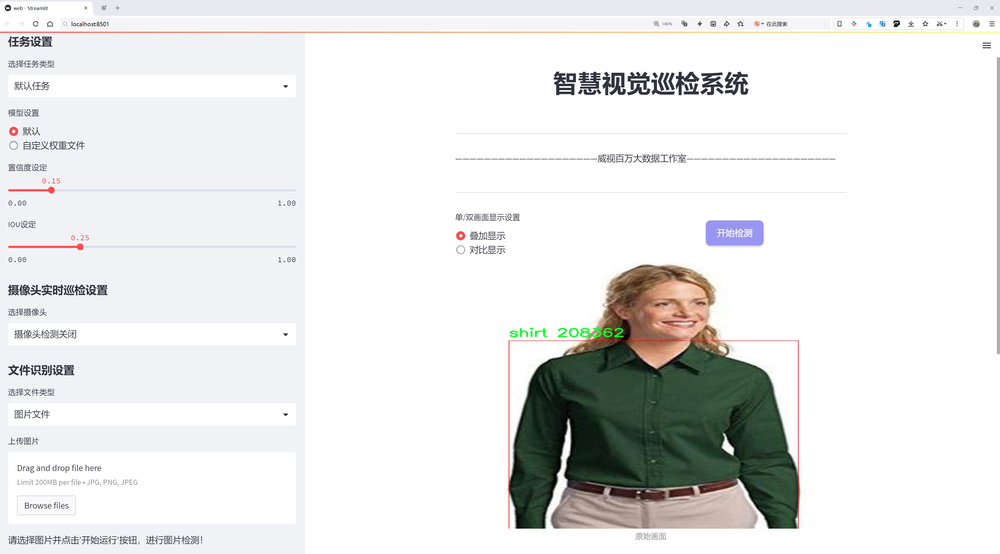
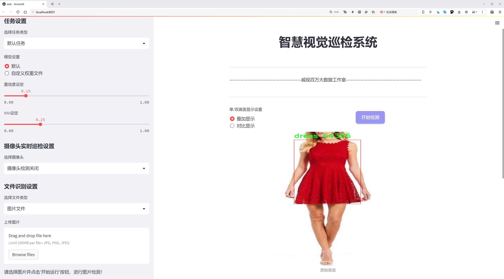
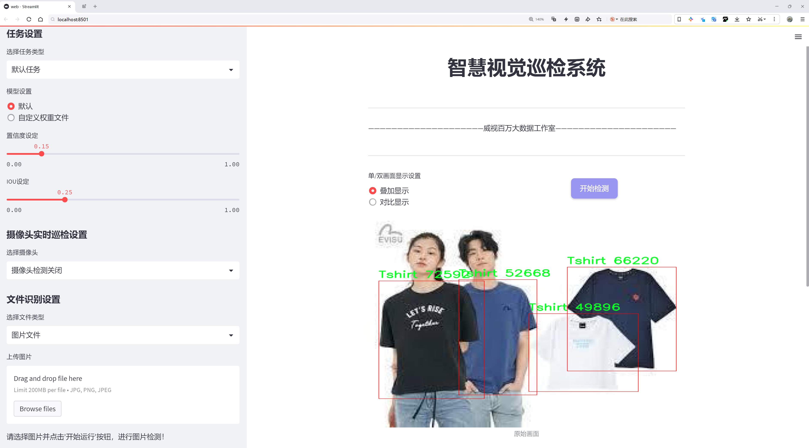
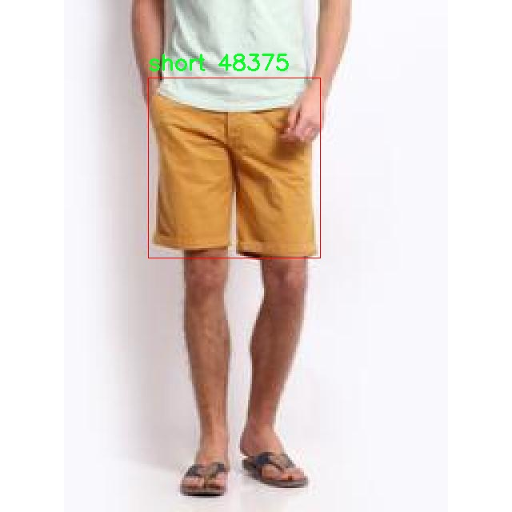
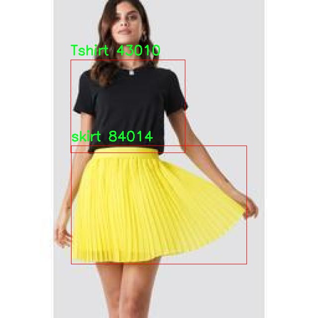
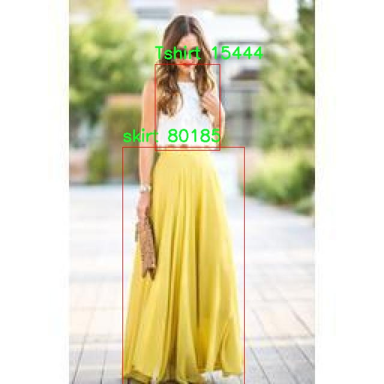
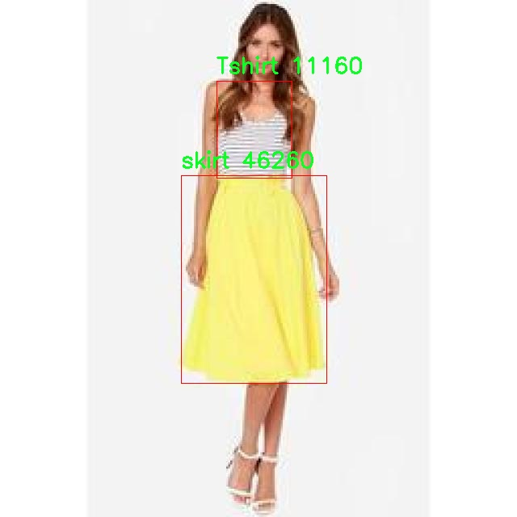
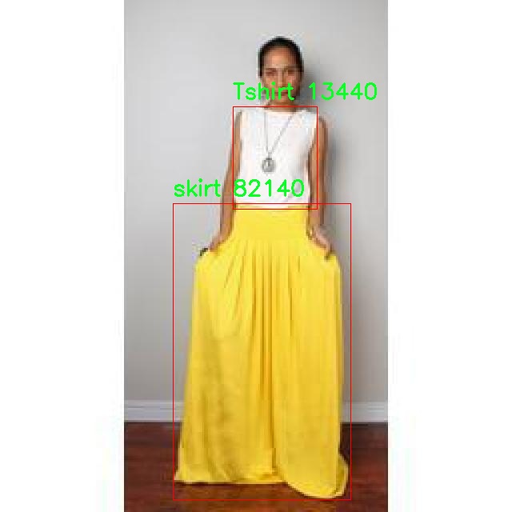

# 服装分类检测检测系统源码分享
 # [一条龙教学YOLOV8标注好的数据集一键训练_70+全套改进创新点发刊_Web前端展示]

### 1.研究背景与意义

项目参考[AAAI Association for the Advancement of Artificial Intelligence](https://gitee.com/qunmasj/projects)

项目来源[AACV Association for the Advancement of Computer Vision](https://kdocs.cn/l/cszuIiCKVNis)

研究背景与意义

随着互联网和电子商务的迅猛发展，服装行业正经历着前所未有的变革。消费者的购物方式逐渐从传统的线下购物转向线上购物，这一转变不仅改变了消费者的购买习惯，也对服装行业的供应链、库存管理和市场营销策略提出了新的挑战。在这一背景下，如何高效、准确地对服装进行分类和检测，成为了提升在线购物体验、优化库存管理以及增强市场竞争力的关键因素之一。基于此，开发一个高效的服装分类检测系统显得尤为重要。

YOLO（You Only Look Once）系列模型因其在目标检测任务中的高效性和准确性而受到广泛关注。YOLOv8作为该系列的最新版本，进一步提升了检测精度和速度，适用于实时目标检测的场景。然而，尽管YOLOv8在许多领域表现出色，但在服装分类检测方面仍存在一些挑战，例如多样化的服装款式、复杂的背景和不同的拍摄角度等。因此，基于改进YOLOv8的服装分类检测系统的研究具有重要的现实意义。

本研究所使用的数据集包含1800张图像，涵盖了8个主要的服装类别，包括T恤、连衣裙、夹克、裤子、衬衫、短裤、裙子和毛衣。这些类别的选择不仅反映了当前市场上常见的服装类型，也为模型的训练和测试提供了丰富的样本数据。通过对这些图像进行标注和分类，可以有效提升模型对不同服装类型的识别能力，进而提高分类检测的准确性。

此外，服装分类检测系统的开发不仅可以为消费者提供更为精准的推荐服务，还可以帮助商家更好地管理库存和优化供应链。例如，基于准确的服装分类，商家可以实时监控各类服装的销售情况，及时调整生产和采购策略，从而降低库存成本，提高资金周转率。同时，消费者在浏览商品时，系统能够根据其历史购买记录和偏好，智能推荐相关服装，提升用户体验。

综上所述，基于改进YOLOv8的服装分类检测系统的研究，不仅具有重要的学术价值，也具备显著的应用前景。通过提升服装分类的准确性和效率，能够有效推动服装行业的数字化转型，促进电子商务的发展。因此，本研究的开展将为服装行业的智能化、自动化提供有力的技术支持，具有重要的理论意义和实践价值。

### 2.图片演示







##### 注意：由于此博客编辑较早，上面“2.图片演示”和“3.视频演示”展示的系统图片或者视频可能为老版本，新版本在老版本的基础上升级如下：（实际效果以升级的新版本为准）

  （1）适配了YOLOV8的“目标检测”模型和“实例分割”模型，通过加载相应的权重（.pt）文件即可自适应加载模型。

  （2）支持“图片识别”、“视频识别”、“摄像头实时识别”三种识别模式。

  （3）支持“图片识别”、“视频识别”、“摄像头实时识别”三种识别结果保存导出，解决手动导出（容易卡顿出现爆内存）存在的问题，识别完自动保存结果并导出到tempDir中。

  （4）支持Web前端系统中的标题、背景图等自定义修改，后面提供修改教程。

  另外本项目提供训练的数据集和训练教程,暂不提供权重文件（best.pt）,需要您按照教程进行训练后实现图片演示和Web前端界面演示的效果。

### 3.视频演示

[3.1 视频演示](https://www.bilibili.com/video/BV1tjsfeeEnK/)

### 4.数据集信息展示

##### 4.1 本项目数据集详细数据（类别数＆类别名）

nc: 8
names: ['Tshirt', 'dress', 'jacket', 'pants', 'shirt', 'short', 'skirt', 'sweater']


##### 4.2 本项目数据集信息介绍

数据集信息展示

在现代计算机视觉领域，尤其是在服装分类和检测的任务中，数据集的质量和多样性直接影响到模型的性能和泛化能力。本研究所采用的数据集名为“clothes classfy”，该数据集专门设计用于训练和改进YOLOv8模型，以实现高效的服装分类检测。该数据集包含8个不同的服装类别，分别为Tshirt、dress、jacket、pants、shirt、short、skirt和sweater。这些类别涵盖了日常生活中常见的服装类型，能够为模型提供丰富的样本，以便更好地学习和识别各种服装的特征。

“clothes classfy”数据集的构建过程充分考虑了多样性和代表性，确保每个类别都包含了不同风格、颜色和材质的服装样本。这种多样性不仅增强了模型的学习能力，还提高了其在实际应用中的适应性。例如，在Tshirt类别中，数据集包含了短袖、长袖、印花和纯色等多种款式，能够帮助模型识别出不同设计和风格的T恤。而在dress类别中，数据集则包括了连衣裙、晚礼服和休闲裙等多种类型，进一步丰富了模型的训练数据。

为了确保数据集的高质量，所有样本均经过严格的标注和审核。每个图像都配有准确的标签，确保模型在训练过程中能够正确学习到每个类别的特征。此外，数据集还考虑到了图像的拍摄角度、光照条件和背景环境等因素，以模拟真实世界中的复杂场景。这种多样化的样本选择和精确的标注方式，为YOLOv8模型的训练提供了坚实的基础，使其能够在各种环境下进行有效的服装分类和检测。

在训练过程中，YOLOv8模型将利用“clothes classfy”数据集中的图像进行特征提取和模式识别。通过深度学习算法，模型能够逐步学习到每个类别的独特特征，从而实现高效的分类和检测。数据集的设计理念不仅关注数量，更强调质量，确保每个类别的样本都能为模型的学习提供有价值的信息。这种方法将有助于提高模型在实际应用中的准确性和可靠性。

总之，“clothes classfy”数据集为本研究提供了一个强大的基础，助力于改进YOLOv8在服装分类检测中的表现。通过对多样化样本的精心设计和高质量标注，该数据集不仅为模型的训练提供了丰富的资源，也为未来的研究和应用奠定了良好的基础。随着计算机视觉技术的不断发展，服装分类检测的准确性和效率将得到进一步提升，为时尚行业的智能化发展贡献力量。











### 5.全套项目环境部署视频教程（零基础手把手教学）

[5.1 环境部署教程链接（零基础手把手教学）](https://www.ixigua.com/7404473917358506534?logTag=c807d0cbc21c0ef59de5)


[5.2 安装Python虚拟环境创建和依赖库安装视频教程链接（零基础手把手教学）](https://www.ixigua.com/7404474678003106304?logTag=1f1041108cd1f708b01a)

### 6.手把手YOLOV8训练视频教程（零基础小白有手就能学会）

[6.1 手把手YOLOV8训练视频教程（零基础小白有手就能学会）](https://www.ixigua.com/7404477157818401292?logTag=d31a2dfd1983c9668658)

### 7.70+种全套YOLOV8创新点代码加载调参视频教程（一键加载写好的改进模型的配置文件）

[7.1 70+种全套YOLOV8创新点代码加载调参视频教程（一键加载写好的改进模型的配置文件）](https://www.ixigua.com/7404478314661806627?logTag=29066f8288e3f4eea3a4)

### 8.70+种全套YOLOV8创新点原理讲解（非科班也可以轻松写刊发刊，V10版本正在科研待更新）

由于篇幅限制，每个创新点的具体原理讲解就不一一展开，具体见下列网址中的创新点对应子项目的技术原理博客网址【Blog】：


[8.1 70+种全套YOLOV8创新点原理讲解链接](https://gitee.com/qunmasj/good)

### 9.系统功能展示（检测对象为举例，实际内容以本项目数据集为准）

图9.1.系统支持检测结果表格显示

  图9.2.系统支持置信度和IOU阈值手动调节

  图9.3.系统支持自定义加载权重文件best.pt(需要你通过步骤5中训练获得)

  图9.4.系统支持摄像头实时识别

  图9.5.系统支持图片识别

  图9.6.系统支持视频识别

  图9.7.系统支持识别结果文件自动保存

  图9.8.系统支持Excel导出检测结果数据


### 10.原始YOLOV8算法原理

原始YOLOv8算法原理

YOLO（You Only Look Once）系列算法自其首次提出以来，便在目标检测领域引领了潮流。YOLOv8作为这一系列的最新版本，承载了前几代算法的创新与发展，展现出更为卓越的性能和灵活性。其核心思想依然是将目标检测问题转化为回归问题，通过一个单一的神经网络模型来同时预测目标的位置和类别。这种方法的优势在于其高效性，能够在实时场景中快速处理图像，满足了现代计算机视觉应用对速度和精度的双重需求。

YOLOv8的网络结构主要由三部分组成：主干网络（backbone）、特征增强网络（neck）和检测头（head）。在主干网络中，YOLOv8继续采用了CSP（Cross Stage Partial）结构的思想，旨在通过分割特征图来增强特征提取的能力。CSP结构通过将特征图分为两个部分，分别进行处理，最后再进行合并，这种方式不仅提高了网络的表达能力，还有效地减轻了模型的计算负担。YOLOv8在此基础上进一步引入了C2f模块，这一模块结合了YOLOv7中的ELAN（Efficient Layer Aggregation Network）模块的设计，增强了残差连接的数量，使得网络在保持轻量化的同时，能够获得更丰富的梯度信息，从而提升了模型的训练效果。

特征增强网络部分，YOLOv8采用了PAN-FPN（Path Aggregation Network - Feature Pyramid Network）的结构。这一结构的设计旨在更好地融合多尺度特征，使得模型能够有效处理不同大小的目标。PAN-FPN通过自下而上的路径聚合特征，结合自上而下的特征传播，形成了一个更为全面的特征表示。与以往的YOLO版本相比，YOLOv8在特征增强方面的创新使得模型在复杂场景下的表现更加优异，能够更好地应对目标的多样性和复杂性。

在检测头部分，YOLOv8引入了全新的解耦合头结构。这一结构将目标的分类和回归任务分离为两个独立的分支，允许模型在处理每个任务时更加专注。这种解耦合的设计解决了以往模型在复杂场景下定位不准和分类错误的问题，显著提高了检测的准确性。同时，YOLOv8采用了Anchor-free的目标检测方法，摆脱了传统目标检测中需要预先定义锚点框的限制。通过直接回归目标的位置和大小，YOLOv8能够更快速地聚焦于目标位置的邻近点，使得预测框更接近于实际的边界框区域。这一创新不仅简化了模型的设计，还提升了检测的灵活性和准确性。

在训练过程中，YOLOv8采用了一系列先进的数据增强技术，借鉴了YOLOX中的动态样本分配策略。通过在训练的最后10个epoch中关闭马赛克增强，YOLOv8能够更好地适应真实场景中的目标分布。此外，YOLOv8在损失计算方面也进行了优化，使用了BCELoss作为分类损失，DFLLoss和CIoULoss作为回归损失。这种多样化的损失函数设计使得模型在训练过程中能够更有效地平衡分类和回归任务的权重，从而提升整体性能。

YOLOv8的发布标志着目标检测技术的又一次飞跃。与之前的YOLO系列相比，YOLOv8在训练时间和检测精度上都得到了显著提升，其模型权重文件的轻量化设计使得它能够在各种嵌入式设备上进行部署。这一特性使得YOLOv8在实时检测的应用场景中表现尤为出色，能够满足现代智能设备对快速响应和高效处理的需求。

综上所述，YOLOv8通过一系列创新的设计和优化，展现了其在目标检测领域的强大能力。无论是在特征提取、特征融合，还是在任务解耦和损失计算方面，YOLOv8都实现了质的飞跃。随着YOLOv8的广泛应用，未来的目标检测技术将迎来更加广阔的发展前景。无论是在农业、工业，还是在智能监控等领域，YOLOv8都将为自动化和智能化的进程提供强有力的支持，推动相关技术的不断进步与发展。


### 11.项目核心源码讲解（再也不用担心看不懂代码逻辑）

#### 11.1 code\ultralytics\models\fastsam\__init__.py

下面是对给定代码的逐行分析和注释，保留了核心部分并进行了详细的中文注释：

```python
# Ultralytics YOLO 🚀, AGPL-3.0 license

# 从当前包中导入 FastSAM 模型类
from .model import FastSAM

# 从当前包中导入 FastSAMPredictor 类，用于进行预测
from .predict import FastSAMPredictor

# 从当前包中导入 FastSAMPrompt 类，用于处理提示信息
from .prompt import FastSAMPrompt

# 从当前包中导入 FastSAMValidator 类，用于验证模型的性能
from .val import FastSAMValidator

# 定义模块的公开接口，包含可以被外部访问的类
__all__ = "FastSAMPredictor", "FastSAM", "FastSAMPrompt", "FastSAMValidator"
```

### 代码核心部分分析：

1. **模块导入**：
   - 代码通过相对导入的方式引入了四个核心类：`FastSAM`、`FastSAMPredictor`、`FastSAMPrompt` 和 `FastSAMValidator`。这些类分别承担不同的功能，是实现YOLO模型的关键组成部分。

2. **`__all__` 的定义**：
   - `__all__` 是一个特殊变量，用于定义模块的公共接口。它列出了可以被外部导入的类名。通过这种方式，用户在使用 `from module import *` 时，只会导入这些指定的类，从而避免了不必要的命名冲突和隐藏实现细节。

### 各个类的功能（假设）：

- **FastSAM**：可能是一个核心模型类，负责模型的构建和训练。
- **FastSAMPredictor**：用于执行模型的预测功能，处理输入数据并返回预测结果。
- **FastSAMPrompt**：可能用于处理用户输入的提示信息，以便更好地与模型交互。
- **FastSAMValidator**：用于验证模型的性能，可能包括评估指标的计算和结果的可视化。

以上是对代码的核心部分及其功能的详细注释和分析。

这个文件是一个Python模块的初始化文件，位于Ultralytics YOLO项目的`fastsam`子目录下。文件的主要功能是导入和暴露该模块中的几个关键类，以便其他模块可以方便地使用它们。

首先，文件的开头有一行注释，表明该项目是Ultralytics YOLO，并且使用AGPL-3.0许可证。这为用户提供了关于项目版权和使用条款的信息。

接下来，文件通过相对导入的方式引入了四个类：`FastSAM`、`FastSAMPredictor`、`FastSAMPrompt`和`FastSAMValidator`。这些类分别来自于同一目录下的不同模块文件。具体来说：

- `FastSAM`类可能是实现FastSAM算法的核心功能。
- `FastSAMPredictor`类可能负责处理预测任务，利用FastSAM算法进行推断。
- `FastSAMPrompt`类可能与用户输入或提示相关，提供交互功能。
- `FastSAMValidator`类可能用于验证模型的性能或输出结果。

最后，`__all__`变量定义了一个字符串元组，列出了该模块希望公开的接口内容。这意味着，当使用`from fastsam import *`的方式导入时，只有这些列出的类会被导入，其他未列出的内容将不会被导入。这是一种控制模块公共接口的方式，有助于避免命名冲突和保护内部实现细节。

总的来说，这个初始化文件的作用是组织和简化模块的使用，使得其他部分的代码能够方便地访问和使用FastSAM相关的功能。

#### 11.2 code\ultralytics\utils\torch_utils.py

以下是代码中最核心的部分，并附上详细的中文注释：

```python
import torch
import torch.nn as nn
import torch.nn.functional as F

def select_device(device="", batch=0, newline=False, verbose=True):
    """
    根据提供的参数选择合适的 PyTorch 设备。

    参数:
        device (str | torch.device, optional): 设备字符串或 torch.device 对象。
            选项包括 'None', 'cpu', 'cuda', '0' 或 '0,1,2,3'。默认为空字符串，自动选择第一个可用的 GPU，或在没有 GPU 时选择 CPU。
        batch (int, optional): 模型使用的批量大小。默认为 0。
        newline (bool, optional): 如果为 True，则在日志字符串末尾添加换行符。默认为 False。
        verbose (bool, optional): 如果为 True，则记录设备信息。默认为 True。

    返回:
        (torch.device): 选择的设备。

    异常:
        ValueError: 如果指定的设备不可用，或者在使用多个 GPU 时批量大小不是设备数量的倍数。
    """
    if isinstance(device, torch.device):
        return device

    device = str(device).lower()
    cpu = device == "cpu"
    if cpu:
        os.environ["CUDA_VISIBLE_DEVICES"] = "-1"  # 强制 torch.cuda.is_available() = False
    elif device:  # 请求非 CPU 设备
        if device == "cuda":
            device = "0"
        os.environ["CUDA_VISIBLE_DEVICES"] = device  # 设置环境变量
        if not (torch.cuda.is_available() and torch.cuda.device_count() >= len(device.replace(",", ""))):
            raise ValueError(f"无效的 CUDA 'device={device}' 请求。")

    if not cpu and torch.cuda.is_available():  # 优先使用可用的 GPU
        devices = device.split(",") if device else "0"  # 例如 0,1,6,7
        n = len(devices)  # 设备数量
        if n > 1 and batch > 0 and batch % n != 0:  # 检查批量大小是否能被设备数量整除
            raise ValueError(f"'batch={batch}' 必须是 GPU 数量 {n} 的倍数。")
        arg = "cuda:0"
    else:  # 回退到 CPU
        arg = "cpu"

    return torch.device(arg)

def fuse_conv_and_bn(conv, bn):
    """融合 Conv2d() 和 BatchNorm2d() 层。"""
    fusedconv = nn.Conv2d(
        conv.in_channels,
        conv.out_channels,
        kernel_size=conv.kernel_size,
        stride=conv.stride,
        padding=conv.padding,
        dilation=conv.dilation,
        groups=conv.groups,
        bias=True,
    ).requires_grad_(False).to(conv.weight.device)

    # 准备滤波器
    w_conv = conv.weight.clone().view(conv.out_channels, -1)
    w_bn = torch.diag(bn.weight.div(torch.sqrt(bn.eps + bn.running_var)))
    fusedconv.weight.copy_(torch.mm(w_bn, w_conv).view(fusedconv.weight.shape))

    # 准备空间偏置
    b_conv = torch.zeros(conv.weight.size(0), device=conv.weight.device) if conv.bias is None else conv.bias
    b_bn = bn.bias - bn.weight.mul(bn.running_mean).div(torch.sqrt(bn.running_var + bn.eps))
    fusedconv.bias.copy_(torch.mm(w_bn, b_conv.reshape(-1, 1)).reshape(-1) + b_bn)

    return fusedconv

def initialize_weights(model):
    """初始化模型权重为随机值。"""
    for m in model.modules():
        if isinstance(m, nn.Conv2d):
            nn.init.kaiming_normal_(m.weight, mode='fan_out', nonlinearity='relu')  # 使用 Kaiming 正态分布初始化卷积层权重
        elif isinstance(m, nn.BatchNorm2d):
            m.eps = 1e-3  # 设置 BatchNorm 的 epsilon
            m.momentum = 0.03  # 设置 BatchNorm 的动量

def time_sync():
    """返回 PyTorch 精确的时间。"""
    if torch.cuda.is_available():
        torch.cuda.synchronize()  # 同步 CUDA 设备
    return time.time()  # 返回当前时间
```

### 代码核心部分解释：
1. **设备选择 (`select_device`)**: 该函数用于选择适合的计算设备（CPU或GPU），并检查设备的可用性。它会根据输入的设备字符串或对象返回相应的 `torch.device` 对象。

2. **卷积与批归一化融合 (`fuse_conv_and_bn`)**: 该函数将卷积层和批归一化层融合为一个层，以提高推理速度和减少计算量。融合后，卷积层的权重和偏置被重新计算并存储在新的卷积层中。

3. **权重初始化 (`initialize_weights`)**: 该函数用于初始化模型中各层的权重，特别是卷积层和批归一化层的权重，以确保模型在训练开始时具有良好的初始状态。

4. **时间同步 (`time_sync`)**: 该函数用于获取当前时间，并在使用 GPU 时确保所有 CUDA 操作完成，以便获取准确的时间测量。

这些函数是构建和训练深度学习模型时的基础工具，确保模型在不同设备上高效运行，并在训练过程中保持良好的性能。

这个程序文件是一个与Ultralytics YOLO（You Only Look Once）相关的工具模块，主要用于深度学习模型的训练和推理，尤其是在使用PyTorch框架时。代码中包含了多个功能函数和类，旨在提高模型的性能和训练效率。

首先，文件导入了一些必要的库，包括数学计算、操作系统交互、随机数生成、时间处理、上下文管理、深拷贝、路径处理以及类型提示等。此外，还导入了NumPy和PyTorch的相关模块，以及Ultralytics库中的一些工具和日志记录功能。

文件中定义了多个函数和类，以下是一些主要功能的简要说明：

1. **分布式训练管理**：通过`torch_distributed_zero_first`上下文管理器，确保在分布式训练中，所有进程在本地主进程完成某些操作之前都处于等待状态。

2. **智能推理模式**：`smart_inference_mode`函数根据PyTorch的版本选择合适的推理模式，确保在推理时不会计算梯度，从而提高性能。

3. **设备选择**：`select_device`函数根据用户输入的设备字符串（如'cpu'或'cuda'）选择合适的PyTorch设备，并进行必要的环境变量设置，以确保模型能够在指定的设备上运行。

4. **模型信息**：`model_info`函数提供有关模型的详细信息，包括参数数量、梯度数量和层数等，并可选择性地输出详细的层级信息。

5. **模型参数和梯度计算**：`get_num_params`和`get_num_gradients`函数分别计算模型的总参数数量和具有梯度的参数数量。

6. **FLOPs计算**：`get_flops`和`get_flops_with_torch_profiler`函数用于计算模型的浮点运算次数（FLOPs），这对于评估模型的计算复杂度非常重要。

7. **权重初始化**：`initialize_weights`函数用于初始化模型的权重，以便在训练开始时设置合适的初始值。

8. **图像缩放和填充**：`scale_img`函数根据给定的比例和网格大小对图像进行缩放和填充，确保输入图像符合模型的要求。

9. **模型的EMA（指数移动平均）**：`ModelEMA`类用于维护模型参数的移动平均，有助于提高模型的稳定性和泛化能力。

10. **早停机制**：`EarlyStopping`类用于在训练过程中监控模型的性能，并在若干个epoch内没有改进时提前停止训练，以避免过拟合。

11. **优化器剥离**：`strip_optimizer`函数用于从训练好的模型中剥离优化器信息，以便在推理时减小模型文件的大小。

12. **性能分析**：`profile`函数用于分析模型的速度、内存和FLOPs，帮助开发者优化模型的性能。

这些功能结合在一起，使得该模块成为YOLO模型训练和推理的一个强大工具，能够有效地管理模型的训练过程、优化性能，并提供丰富的模型信息。

#### 11.3 code\ultralytics\data\build.py

以下是代码中最核心的部分，并附上详细的中文注释：

```python
import os
import random
import numpy as np
import torch
from torch.utils.data import dataloader, distributed
from .dataset import YOLODataset
from .utils import PIN_MEMORY

class InfiniteDataLoader(dataloader.DataLoader):
    """
    无限循环的数据加载器，继承自 PyTorch 的 DataLoader。
    该加载器会重复使用工作线程。
    """

    def __init__(self, *args, **kwargs):
        """初始化无限数据加载器，设置批次采样器为重复采样器。"""
        super().__init__(*args, **kwargs)
        object.__setattr__(self, "batch_sampler", _RepeatSampler(self.batch_sampler))
        self.iterator = super().__iter__()

    def __len__(self):
        """返回批次采样器的长度。"""
        return len(self.batch_sampler.sampler)

    def __iter__(self):
        """创建一个无限重复的采样器。"""
        for _ in range(len(self)):
            yield next(self.iterator)

    def reset(self):
        """
        重置迭代器。

        当我们想在训练过程中修改数据集设置时，这个方法非常有用。
        """
        self.iterator = self._get_iterator()


class _RepeatSampler:
    """
    永久重复的采样器。

    参数:
        sampler (Dataset.sampler): 要重复的采样器。
    """

    def __init__(self, sampler):
        """初始化一个对象，使其无限重复给定的采样器。"""
        self.sampler = sampler

    def __iter__(self):
        """迭代给定的采样器并返回其内容。"""
        while True:
            yield from iter(self.sampler)


def seed_worker(worker_id):
    """设置数据加载器工作线程的随机种子。"""
    worker_seed = torch.initial_seed() % 2**32  # 获取当前线程的随机种子
    np.random.seed(worker_seed)  # 设置 NumPy 随机种子
    random.seed(worker_seed)  # 设置 Python 随机种子


def build_yolo_dataset(cfg, img_path, batch, data, mode="train", rect=False, stride=32):
    """构建 YOLO 数据集。"""
    return YOLODataset(
        img_path=img_path,  # 图像路径
        imgsz=cfg.imgsz,  # 图像大小
        batch_size=batch,  # 批次大小
        augment=mode == "train",  # 是否进行数据增强
        hyp=cfg,  # 超参数配置
        rect=cfg.rect or rect,  # 是否使用矩形批次
        cache=cfg.cache or None,  # 缓存设置
        single_cls=cfg.single_cls or False,  # 是否使用单类检测
        stride=int(stride),  # 步幅
        pad=0.0 if mode == "train" else 0.5,  # 填充设置
        prefix=colorstr(f"{mode}: "),  # 前缀
        task=cfg.task,  # 任务类型
        classes=cfg.classes,  # 类别
        data=data,  # 数据配置
        fraction=cfg.fraction if mode == "train" else 1.0,  # 训练时的数据比例
    )


def build_dataloader(dataset, batch, workers, shuffle=True, rank=-1):
    """返回用于训练或验证集的 InfiniteDataLoader 或 DataLoader。"""
    batch = min(batch, len(dataset))  # 确保批次大小不超过数据集大小
    nd = torch.cuda.device_count()  # 获取 CUDA 设备数量
    nw = min([os.cpu_count() // max(nd, 1), workers])  # 计算工作线程数量
    sampler = None if rank == -1 else distributed.DistributedSampler(dataset, shuffle=shuffle)  # 分布式采样器
    generator = torch.Generator()  # 创建随机数生成器
    generator.manual_seed(6148914691236517205 + RANK)  # 设置随机种子
    return InfiniteDataLoader(
        dataset=dataset,  # 数据集
        batch_size=batch,  # 批次大小
        shuffle=shuffle and sampler is None,  # 是否打乱数据
        num_workers=nw,  # 工作线程数量
        sampler=sampler,  # 采样器
        pin_memory=PIN_MEMORY,  # 是否使用固定内存
        collate_fn=getattr(dataset, "collate_fn", None),  # 合并函数
        worker_init_fn=seed_worker,  # 工作线程初始化函数
        generator=generator,  # 随机数生成器
    )


def check_source(source):
    """检查输入源类型并返回相应的标志值。"""
    webcam, screenshot, from_img, in_memory, tensor = False, False, False, False, False
    if isinstance(source, (str, int, Path)):  # 如果是字符串、整数或路径
        source = str(source)
        is_file = Path(source).suffix[1:] in (IMG_FORMATS + VID_FORMATS)  # 检查是否为文件
        is_url = source.lower().startswith(("https://", "http://", "rtsp://", "rtmp://", "tcp://"))  # 检查是否为 URL
        webcam = source.isnumeric() or source.endswith(".streams") or (is_url and not is_file)  # 检查是否为网络摄像头
        screenshot = source.lower() == "screen"  # 检查是否为屏幕截图
        if is_url and is_file:
            source = check_file(source)  # 下载文件
    elif isinstance(source, LOADERS):
        in_memory = True  # 如果是加载器，则在内存中
    elif isinstance(source, (list, tuple)):
        source = autocast_list(source)  # 将列表元素转换为 PIL 或 np 数组
        from_img = True
    elif isinstance(source, (Image.Image, np.ndarray)):
        from_img = True  # 如果是图像或数组
    elif isinstance(source, torch.Tensor):
        tensor = True  # 如果是张量
    else:
        raise TypeError("不支持的图像类型。")

    return source, webcam, screenshot, from_img, in_memory, tensor


def load_inference_source(source=None, imgsz=640, vid_stride=1, buffer=False):
    """
    加载用于目标检测的推理源并应用必要的转换。

    参数:
        source (str, Path, Tensor, PIL.Image, np.ndarray): 输入源。
        imgsz (int, optional): 推理图像大小，默认为 640。
        vid_stride (int, optional): 视频源的帧间隔，默认为 1。
        buffer (bool, optional): 是否缓冲流帧，默认为 False。

    返回:
        dataset (Dataset): 指定输入源的数据集对象。
    """
    source, webcam, screenshot, from_img, in_memory, tensor = check_source(source)  # 检查源类型
    source_type = source.source_type if in_memory else SourceTypes(webcam, screenshot, from_img, tensor)  # 确定源类型

    # 根据源类型加载数据集
    if tensor:
        dataset = LoadTensor(source)  # 如果是张量
    elif in_memory:
        dataset = source  # 如果在内存中
    elif webcam:
        dataset = LoadStreams(source, imgsz=imgsz, vid_stride=vid_stride, buffer=buffer)  # 如果是网络摄像头
    elif screenshot:
        dataset = LoadScreenshots(source, imgsz=imgsz)  # 如果是屏幕截图
    elif from_img:
        dataset = LoadPilAndNumpy(source, imgsz=imgsz)  # 如果是图像
    else:
        dataset = LoadImages(source, imgsz=imgsz, vid_stride=vid_stride)  # 默认加载图像

    # 将源类型附加到数据集
    setattr(dataset, "source_type", source_type)

    return dataset  # 返回数据集对象
```

这段代码的核心部分主要包括自定义的数据加载器 `InfiniteDataLoader` 和 `_RepeatSampler`，用于在训练过程中不断重复使用数据。还包括构建 YOLO 数据集和数据加载器的函数，以及检查输入源类型和加载推理源的功能。每个函数和类都有详细的中文注释，解释其功能和参数。

这个程序文件是用于构建和管理YOLO（You Only Look Once）模型的数据加载器，主要功能是处理数据集的加载和预处理，以便于模型的训练和推理。

首先，文件导入了一些必要的库，包括操作系统相关的库、随机数生成库、路径处理库、NumPy、PyTorch以及一些与数据加载相关的模块。接着，定义了一个名为`InfiniteDataLoader`的类，它继承自PyTorch的`DataLoader`，实现了一个可以无限循环使用工作线程的数据加载器。这个类重写了`__len__`和`__iter__`方法，使得在迭代时可以不断地重复使用数据。

在`InfiniteDataLoader`内部，还定义了一个名为`_RepeatSampler`的类，用于实现无限重复的采样器。这个采样器会不断地迭代给定的采样器，确保数据可以持续提供。

接下来，定义了一个`seed_worker`函数，用于设置数据加载器工作线程的随机种子，以确保在多线程环境下的随机性一致性。

`build_yolo_dataset`函数用于构建YOLO数据集，接收配置参数、图像路径、批量大小等信息，并返回一个`YOLODataset`对象。这个函数会根据训练模式和其他参数来决定是否进行数据增强、是否使用矩形批次等。

`build_dataloader`函数则是用于返回一个`InfiniteDataLoader`或普通的`DataLoader`，它会根据数据集的大小、工作线程的数量、是否进行洗牌等参数来配置数据加载器。它还会考虑分布式训练的情况，使用`DistributedSampler`来处理数据。

`check_source`函数用于检查输入数据源的类型，判断它是文件、URL、摄像头、图像、NumPy数组还是张量，并返回相应的标志值，以便后续处理。

最后，`load_inference_source`函数用于加载推理源，接收输入源、图像大小、视频帧间隔等参数，并根据源的类型创建相应的数据集对象。这个函数支持多种输入源类型，包括张量、图像、视频流等，并在创建的数据集中附加源类型的信息。

整体而言，这个文件的主要目的是提供一个灵活的数据加载机制，以支持YOLO模型的训练和推理，确保数据能够高效且正确地被加载和处理。

#### 11.4 70+种YOLOv8算法改进源码大全和调试加载训练教程（非必要）\ultralytics\engine\trainer.py

以下是经过简化和注释的核心代码部分，主要关注训练模型的基本流程和重要方法。

```python
class BaseTrainer:
    """
    BaseTrainer 类用于创建训练器的基类，负责模型的训练过程。
    """

    def __init__(self, cfg=DEFAULT_CFG, overrides=None, _callbacks=None):
        """
        初始化 BaseTrainer 类。

        参数:
            cfg (str, optional): 配置文件路径，默认为 DEFAULT_CFG。
            overrides (dict, optional): 配置覆盖，默认为 None。
        """
        # 获取配置
        self.args = get_cfg(cfg, overrides)
        self.check_resume(overrides)  # 检查是否需要从检查点恢复训练
        self.device = select_device(self.args.device, self.args.batch)  # 选择训练设备
        self.model = None  # 模型实例
        self.trainset, self.testset = self.get_dataset(self.args.data)  # 获取训练和测试数据集
        self.optimizer = None  # 优化器
        self.scheduler = None  # 学习率调度器
        self.best_fitness = None  # 最佳适应度
        self.start_epoch = 0  # 开始训练的 epoch

    def train(self):
        """开始训练过程。"""
        world_size = self._get_world_size()  # 获取世界大小（GPU 数量）

        if world_size > 1 and 'LOCAL_RANK' not in os.environ:
            # 如果是多 GPU 训练，生成 DDP 命令并运行
            cmd, file = generate_ddp_command(world_size, self)
            subprocess.run(cmd, check=True)  # 运行命令
            ddp_cleanup(self, str(file))  # 清理 DDP 相关的设置
        else:
            self._do_train(world_size)  # 单 GPU 训练

    def _do_train(self, world_size=1):
        """执行训练过程，包括数据加载、模型训练和验证。"""
        self._setup_train(world_size)  # 设置训练参数和数据加载器

        for epoch in range(self.start_epoch, self.args.epochs):
            self.model.train()  # 设置模型为训练模式
            for i, batch in enumerate(self.train_loader):  # 遍历训练数据
                self.optimizer.zero_grad()  # 清空梯度
                loss, loss_items = self.model(batch)  # 前向传播计算损失
                loss.backward()  # 反向传播
                self.optimizer.step()  # 更新参数

            # 每个 epoch 结束后进行验证
            if (epoch + 1) % self.args.val_interval == 0:
                self.validate()  # 验证模型性能

    def validate(self):
        """在验证集上评估模型性能。"""
        self.model.eval()  # 设置模型为评估模式
        with torch.no_grad():  # 不计算梯度
            for batch in self.test_loader:
                # 进行验证逻辑
                pass  # 具体验证逻辑省略

    def _setup_train(self, world_size):
        """设置训练所需的参数和数据加载器。"""
        self.model = self.setup_model()  # 设置模型
        self.optimizer = self.build_optimizer(self.model)  # 构建优化器
        self.train_loader = self.get_dataloader(self.trainset)  # 获取训练数据加载器
        self.test_loader = self.get_dataloader(self.testset)  # 获取测试数据加载器

    def build_optimizer(self, model):
        """构建优化器。"""
        return optim.Adam(model.parameters(), lr=self.args.lr)  # 使用 Adam 优化器

    def get_dataloader(self, dataset):
        """返回数据加载器。"""
        return torch.utils.data.DataLoader(dataset, batch_size=self.args.batch, shuffle=True)  # 返回数据加载器

    def get_dataset(self, data):
        """从数据字典中获取训练和验证路径。"""
        return data['train'], data.get('val') or data.get('test')  # 返回训练和验证数据集路径

    def check_resume(self, overrides):
        """检查是否存在恢复检查点并更新参数。"""
        resume = self.args.resume
        if resume:
            # 检查恢复路径是否存在
            pass  # 具体实现省略

    def setup_model(self):
        """加载或创建模型。"""
        # 具体实现省略
        pass
```

### 代码说明
1. **BaseTrainer 类**: 这是一个训练器的基类，负责管理训练过程的各个方面。
2. **初始化方法 (`__init__`)**: 初始化配置、设备选择、数据集获取等。
3. **训练方法 (`train`)**: 开始训练过程，支持多 GPU 训练。
4. **训练过程 (`_do_train`)**: 包含训练循环和验证逻辑。
5. **验证方法 (`validate`)**: 在验证集上评估模型性能。
6. **设置训练 (`_setup_train`)**: 设置模型、优化器和数据加载器。
7. **构建优化器 (`build_optimizer`)**: 创建优化器实例。
8. **获取数据加载器 (`get_dataloader`)**: 返回训练或测试数据的加载器。
9. **检查恢复 (`check_resume`)**: 检查是否需要从检查点恢复训练。
10. **设置模型 (`setup_model`)**: 加载或创建模型的逻辑。

以上代码和注释提供了训练过程的核心逻辑，适合用于理解和扩展训练器的功能。

这个程序文件是一个用于训练YOLOv8模型的基础类`BaseTrainer`的实现，包含了训练过程中的各个环节和相关配置。文件的开头包含了使用说明，指明了如何通过命令行参数启动训练。

在文件中，首先导入了一些必要的库和模块，包括数学运算、文件操作、时间处理、深度学习相关的PyTorch库等。接着，定义了`BaseTrainer`类，该类包含了训练模型所需的多个属性和方法。

类的构造函数`__init__`初始化了一些基本参数，包括配置文件、设备选择、模型和数据集的准备等。它会根据传入的配置文件和重写参数来设置训练的相关参数，并创建保存结果的目录。它还会检查数据集的有效性，并根据任务类型（分类、检测等）来加载相应的数据集。

`BaseTrainer`类中包含多个方法，例如`train`方法用于启动训练过程，`_setup_ddp`方法用于设置分布式数据并行训练的参数，`_setup_train`方法则用于构建数据加载器和优化器。训练过程中，模型会在每个epoch中进行训练和验证，并根据设定的条件保存模型的检查点。

训练过程中，使用了自动混合精度（AMP）来提高训练效率，并在每个batch的训练中进行损失计算和反向传播。通过`optimizer_step`方法执行优化步骤，并在每个epoch结束时进行验证，更新模型的状态。

此外，类中还定义了一些用于处理回调、保存模型、加载数据集和构建优化器的方法。通过回调机制，可以在训练的不同阶段执行特定的操作，比如记录日志、绘制训练过程中的样本等。

最后，类中还包含了一些用于保存训练指标、绘制训练图表和进行最终评估的方法。整体来看，这个文件提供了一个完整的YOLOv8模型训练框架，支持多种训练配置和参数调整，适用于深度学习研究和应用。

#### 11.5 train.py

以下是代码中最核心的部分，并附上详细的中文注释：

```python
class DetectionTrainer(BaseTrainer):
    """
    DetectionTrainer类，继承自BaseTrainer类，用于基于检测模型的训练。
    """

    def build_dataset(self, img_path, mode="train", batch=None):
        """
        构建YOLO数据集。

        参数:
            img_path (str): 包含图像的文件夹路径。
            mode (str): 模式，可以是'train'或'val'，用户可以为每种模式自定义不同的数据增强。
            batch (int, optional): 批次大小，仅用于'rect'模式。默认为None。
        """
        gs = max(int(de_parallel(self.model).stride.max() if self.model else 0), 32)
        return build_yolo_dataset(self.args, img_path, batch, self.data, mode=mode, rect=mode == "val", stride=gs)

    def get_dataloader(self, dataset_path, batch_size=16, rank=0, mode="train"):
        """构造并返回数据加载器。"""
        assert mode in ["train", "val"]  # 确保模式为'train'或'val'
        with torch_distributed_zero_first(rank):  # 在分布式训练中，仅初始化数据集一次
            dataset = self.build_dataset(dataset_path, mode, batch_size)  # 构建数据集
        shuffle = mode == "train"  # 训练模式下打乱数据
        if getattr(dataset, "rect", False) and shuffle:
            LOGGER.warning("WARNING ⚠️ 'rect=True'与DataLoader的shuffle不兼容，设置shuffle=False")
            shuffle = False
        workers = self.args.workers if mode == "train" else self.args.workers * 2  # 设置工作线程数
        return build_dataloader(dataset, batch_size, workers, shuffle, rank)  # 返回数据加载器

    def preprocess_batch(self, batch):
        """对一批图像进行预处理，包括缩放和转换为浮点数。"""
        batch["img"] = batch["img"].to(self.device, non_blocking=True).float() / 255  # 将图像转换为浮点数并归一化
        if self.args.multi_scale:  # 如果启用多尺度训练
            imgs = batch["img"]
            sz = (
                random.randrange(self.args.imgsz * 0.5, self.args.imgsz * 1.5 + self.stride)
                // self.stride
                * self.stride
            )  # 随机选择一个新的尺寸
            sf = sz / max(imgs.shape[2:])  # 计算缩放因子
            if sf != 1:  # 如果缩放因子不为1
                ns = [
                    math.ceil(x * sf / self.stride) * self.stride for x in imgs.shape[2:]
                ]  # 计算新的形状
                imgs = nn.functional.interpolate(imgs, size=ns, mode="bilinear", align_corners=False)  # 进行插值缩放
            batch["img"] = imgs  # 更新批次中的图像
        return batch

    def get_model(self, cfg=None, weights=None, verbose=True):
        """返回一个YOLO检测模型。"""
        model = DetectionModel(cfg, nc=self.data["nc"], verbose=verbose and RANK == -1)  # 创建检测模型
        if weights:
            model.load(weights)  # 加载权重
        return model

    def get_validator(self):
        """返回用于YOLO模型验证的DetectionValidator。"""
        self.loss_names = "box_loss", "cls_loss", "dfl_loss"  # 定义损失名称
        return yolo.detect.DetectionValidator(
            self.test_loader, save_dir=self.save_dir, args=copy(self.args), _callbacks=self.callbacks
        )  # 返回验证器

    def plot_training_samples(self, batch, ni):
        """绘制带有注释的训练样本。"""
        plot_images(
            images=batch["img"],
            batch_idx=batch["batch_idx"],
            cls=batch["cls"].squeeze(-1),
            bboxes=batch["bboxes"],
            paths=batch["im_file"],
            fname=self.save_dir / f"train_batch{ni}.jpg",
            on_plot=self.on_plot,
        )
```

### 代码核心部分说明：
1. **DetectionTrainer类**：该类负责YOLO模型的训练，继承自`BaseTrainer`，封装了训练过程中所需的各种功能。
2. **build_dataset方法**：用于构建YOLO数据集，支持训练和验证模式，能够根据模式自定义数据增强。
3. **get_dataloader方法**：构造数据加载器，支持分布式训练，并根据模式选择是否打乱数据。
4. **preprocess_batch方法**：对输入的图像批次进行预处理，包括归一化和可选的多尺度调整。
5. **get_model方法**：返回一个YOLO检测模型，并可选择加载预训练权重。
6. **get_validator方法**：返回用于模型验证的验证器，包含损失名称的定义。
7. **plot_training_samples方法**：用于绘制训练样本及其注释，便于可视化训练过程。

这个程序文件 `train.py` 是一个用于训练 YOLO（You Only Look Once）目标检测模型的实现，继承自 `BaseTrainer` 类。文件中包含了多个方法，主要用于构建数据集、获取数据加载器、预处理图像、设置模型属性、获取模型、进行验证、记录损失、显示训练进度、绘制训练样本和绘制训练指标等。

首先，`DetectionTrainer` 类的构造函数定义了如何构建 YOLO 数据集。`build_dataset` 方法接收图像路径、模式（训练或验证）和批量大小，利用 `build_yolo_dataset` 函数创建数据集。这里使用了模型的步幅来确保图像尺寸的合理性。

`get_dataloader` 方法则负责构建并返回数据加载器。它根据模式（训练或验证）决定是否打乱数据，并设置工作线程的数量。为了提高效率，在分布式训练时，它确保数据集只初始化一次。

在图像预处理方面，`preprocess_batch` 方法将图像缩放到合适的尺寸，并将其转换为浮点数格式，便于后续处理。这里还实现了多尺度训练的功能，通过随机选择图像大小来增强模型的鲁棒性。

`set_model_attributes` 方法用于设置模型的属性，包括类别数量和类别名称等，确保模型能够正确处理特定数据集。

获取 YOLO 检测模型的功能由 `get_model` 方法实现，该方法根据配置文件和权重加载模型。`get_validator` 方法则返回一个用于验证模型性能的验证器。

在损失记录方面，`label_loss_items` 方法返回一个包含训练损失项的字典，便于后续分析和监控训练过程中的性能。

`progress_string` 方法格式化训练进度的字符串，显示当前的训练轮次、GPU 内存使用情况、损失值、实例数量和图像大小等信息，便于用户跟踪训练进度。

此外，`plot_training_samples` 方法用于绘制训练样本及其标注，帮助可视化训练数据的质量。最后，`plot_metrics` 和 `plot_training_labels` 方法则用于绘制训练过程中的指标和标签，提供更直观的训练结果展示。

总体来说，这个文件实现了 YOLO 模型训练的各个环节，涵盖了数据处理、模型构建、训练监控和结果可视化等多个方面，是一个完整的目标检测训练框架。

#### 11.6 code\ultralytics\models\yolo\model.py

```python
# 导入所需的模块和类
from ultralytics.engine.model import Model
from ultralytics.models import yolo
from ultralytics.nn.tasks import ClassificationModel, DetectionModel, OBBModel, PoseModel, SegmentationModel

class YOLO(Model):
    """YOLO (You Only Look Once) 目标检测模型的定义类。"""

    @property
    def task_map(self):
        """将任务类型映射到相应的模型、训练器、验证器和预测器类。"""
        return {
            "classify": {  # 分类任务
                "model": ClassificationModel,  # 分类模型
                "trainer": yolo.classify.ClassificationTrainer,  # 分类训练器
                "validator": yolo.classify.ClassificationValidator,  # 分类验证器
                "predictor": yolo.classify.ClassificationPredictor,  # 分类预测器
            },
            "detect": {  # 检测任务
                "model": DetectionModel,  # 检测模型
                "trainer": yolo.detect.DetectionTrainer,  # 检测训练器
                "validator": yolo.detect.DetectionValidator,  # 检测验证器
                "predictor": yolo.detect.DetectionPredictor,  # 检测预测器
            },
            "segment": {  # 分割任务
                "model": SegmentationModel,  # 分割模型
                "trainer": yolo.segment.SegmentationTrainer,  # 分割训练器
                "validator": yolo.segment.SegmentationValidator,  # 分割验证器
                "predictor": yolo.segment.SegmentationPredictor,  # 分割预测器
            },
            "pose": {  # 姿态估计任务
                "model": PoseModel,  # 姿态模型
                "trainer": yolo.pose.PoseTrainer,  # 姿态训练器
                "validator": yolo.pose.PoseValidator,  # 姿态验证器
                "predictor": yolo.pose.PosePredictor,  # 姿态预测器
            },
            "obb": {  # 方向边界框任务
                "model": OBBModel,  # 方向边界框模型
                "trainer": yolo.obb.OBBTrainer,  # 方向边界框训练器
                "validator": yolo.obb.OBBValidator,  # 方向边界框验证器
                "predictor": yolo.obb.OBBPredictor,  # 方向边界框预测器
            },
        }
```

### 代码核心部分说明：
1. **导入模块**：首先导入了需要的模块和类，包括模型的基类和不同任务的模型类。
2. **YOLO类**：定义了一个名为`YOLO`的类，继承自`Model`，表示YOLO目标检测模型。
3. **task_map属性**：该属性返回一个字典，映射不同的任务类型（如分类、检测、分割、姿态估计和方向边界框）到相应的模型、训练器、验证器和预测器。这使得模型可以根据任务类型灵活选择相应的组件。

这个程序文件定义了一个名为 `YOLO` 的类，继承自 `Model` 类，主要用于实现 YOLO（You Only Look Once）目标检测模型。文件开头包含了版权信息，表明该代码遵循 AGPL-3.0 许可证。

在 `YOLO` 类中，有一个名为 `task_map` 的属性方法。这个方法返回一个字典，字典的键是不同的任务类型（如分类、检测、分割、姿态估计和方向边界框），每个键对应的值又是一个字典，包含了与该任务相关的模型、训练器、验证器和预测器类。

具体来说，`task_map` 字典的结构如下：

- 对于 "classify" 任务，映射到 `ClassificationModel` 及其相应的训练、验证和预测类。
- 对于 "detect" 任务，映射到 `DetectionModel` 及其相应的训练、验证和预测类。
- 对于 "segment" 任务，映射到 `SegmentationModel` 及其相应的训练、验证和预测类。
- 对于 "pose" 任务，映射到 `PoseModel` 及其相应的训练、验证和预测类。
- 对于 "obb" 任务，映射到 `OBBModel` 及其相应的训练、验证和预测类。

通过这种方式，`YOLO` 类可以根据不同的任务类型灵活地选择相应的模型和工具，使得在进行目标检测及其他相关任务时，能够方便地进行扩展和管理。

### 12.系统整体结构（节选）

### 整体功能和构架概括

该项目是一个基于YOLO（You Only Look Once）目标检测算法的深度学习框架，包含了多个模块和工具，用于模型的训练、推理和数据处理。项目的整体架构设计灵活且模块化，便于扩展和维护。主要功能包括：

1. **模型定义与管理**：提供多种YOLO模型的实现，支持不同的任务类型（如检测、分类、分割等）。
2. **数据处理**：实现了高效的数据加载和预处理机制，支持多种数据源和增强技术。
3. **训练与验证**：提供训练过程的管理，包括损失计算、模型保存、早停机制等。
4. **推理与评估**：支持模型的推理和性能评估，能够输出预测结果和相关指标。
5. **工具与实用函数**：提供多种实用工具函数，支持设备选择、参数初始化、图像处理等。

以下是项目中各个文件的功能整理表格：

| 文件路径                                                                                          | 功能描述                                                                                      |
|---------------------------------------------------------------------------------------------------|-----------------------------------------------------------------------------------------------|
| `code/ultralytics/models/fastsam/__init__.py`                                                    | 初始化FastSAM模块，导入核心类以供其他模块使用。                                               |
| `code/ultralytics/utils/torch_utils.py`                                                          | 提供与PyTorch相关的工具函数，如设备选择、模型信息、数据加载、早停机制等。                     |
| `code/ultralytics/data/build.py`                                                                  | 构建YOLO数据集和数据加载器，支持多种输入源和数据增强。                                         |
| `70+种YOLOv8算法改进源码大全和调试加载训练教程（非必要）/ultralytics/engine/trainer.py`          | 实现YOLO模型的训练框架，管理训练过程、损失记录、验证和模型保存等功能。                         |
| `train.py`                                                                                        | 具体实现YOLO模型的训练过程，处理数据集、模型构建、训练监控和结果可视化等。                     |
| `code/ultralytics/models/yolo/model.py`                                                          | 定义YOLO模型类，管理不同任务类型的模型和相关工具。                                             |
| `70+种YOLOv8算法改进源码大全和调试加载训练教程（非必要）/ultralytics/models/sam/modules/decoders.py` | 实现SAM（Segment Anything Model）模块的解码器，处理模型输出。                                 |
| `70+种YOLOv8算法改进源码大全和调试加载训练教程（非必要）/ultralytics/nn/backbone/VanillaNet.py` | 定义VanillaNet骨干网络，用于特征提取。                                                        |
| `code/ultralytics/models/sam/amg.py`                                                             | 实现SAM模块的自适应多尺度生成（AMG）功能，处理多尺度输入。                                     |
| `code/ultralytics/trackers/byte_tracker.py`                                                     | 实现ByteTracker，支持目标跟踪功能。                                                            |
| `code/ultralytics/utils/callbacks/mlflow.py`                                                    | 提供与MLflow集成的回调函数，用于模型训练过程中的监控和记录。                                   |
| `ui.py`                                                                                           | 实现用户界面相关功能，可能用于可视化训练过程或结果展示。                                       |
| `code/ultralytics/utils/loss.py`                                                                 | 定义损失函数的实现，计算模型训练过程中的损失值。                                              |

这个表格总结了项目中各个文件的主要功能，展示了项目的模块化设计和各部分之间的协作关系。

注意：由于此博客编辑较早，上面“11.项目核心源码讲解（再也不用担心看不懂代码逻辑）”中部分代码可能会优化升级，仅供参考学习，完整“训练源码”、“Web前端界面”和“70+种创新点源码”以“13.完整训练+Web前端界面+70+种创新点源码、数据集获取”的内容为准。

### 13.完整训练+Web前端界面+70+种创新点源码、数据集获取


# [下载链接：https://mbd.pub/o/bread/Zpubkphp](https://mbd.pub/o/bread/Zpubkphp)